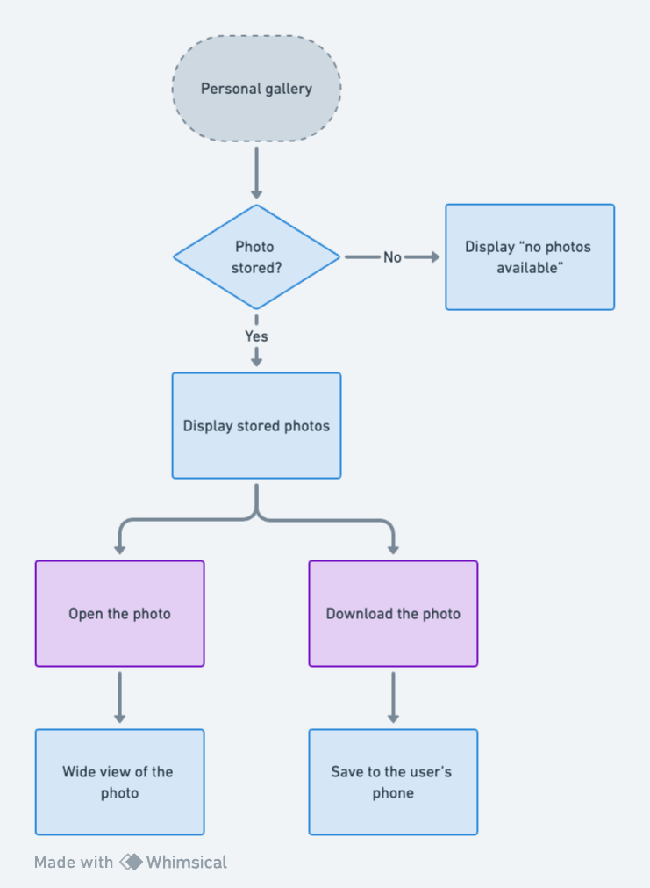

# Functional specification

Table of contents

- [Functional specification](#functional-specification)
- [Project Overview](#project-overview)
  - [Report Issues](#report-issues)
- [Project Definition](#project-definition)
  - [Vision](#vision)
  - [Objectives](#objectives)
  - [Scope](#scope)
    - [All Users (Both Admin and Participant)](#all-users-both-admin-and-participant)
    - [Admin Users](#admin-users)
    - [Participant Users](#participant-users)
  - [Out of Scope](#out-of-scope)
- [Project Organisation](#project-organisation)
  - [Stakeholders](#stakeholders)
  - [Timeline](#timeline)
  - [Milestones](#milestones)
  - [Risks and Assumptions](#risks-and-assumptions)
    - [Risks](#risks)
    - [Assumptions](#assumptions)
  - [Constraints](#constraints)
- [Functional Requirements](#functional-requirements)
  - [Features Overview](#features-overview)
  - [Features Breakdown](#features-breakdown)
    - [Ubiquitous Requirements](#ubiquitous-requirements)
    - [State-driven Requirements](#state-driven-requirements)
    - [Event-driven Requirements](#event-driven-requirements)
    - [Unwanted Behaviour Requirements](#unwanted-behaviour-requirements)
    - [Complex Requirements](#complex-requirements)
  - [User Interface and Design](#user-interface-and-design)
- [Target Audience](#target-audience)
  - [Personas](#personas)
  - [User Cases](#user-cases)
  - [User Journey Map](#user-journey-map)
  - [Functional Analysis](#functional-analysis)
- [Non-Functional Requirements](#non-functional-requirements)
  - [Reliability](#reliability)
  - [Operability](#operability)
  - [Recovery](#recovery)
  - [Delivery](#delivery)
  - [Maintainability](#maintainability)
  - [Security](#security)
- [Glossary](#glossary)

 

# Project Overview

The Disposable Camera application aims to provide users with a unique and nostalgic experience of capturing and sharing moments at events. Inspired by disposable cameras, the app offers a user-friendly interface for event participants to take photos, share them with others, and create lasting memories. With features like customisable camera settings, event galleries, and cross-platform compatibility, the app aims to enhance the event experience and promote engagement among attendees.

## Report Issues

If you notice errors in this document, or would like to give feedback, please file a Doc Issue in the MOONSHOT-DISPOSABLE GitHub repository: https://github.com/Clementine951/MOONSHOT-DISPOSABLE/issues

# Project Definition

## Vision

The vision for the Disposable Camera application project is to develop a user-friendly mobile application that facilitates effortless capturing and sharing of memorable moments during events, with a particular focus on enhancing accessibility for older individuals. By prioritising simplicity, intuitiveness, and inclusivity, the app aims to bridge generational gaps and foster meaningful connections among attendees, ensuring that everyone can participate fully in capturing and reliving event experiences.

## Objectives

- Capture and share moments
- Nostalgic experience
- User-friendly interface
- Cross-platform compatibility
- Enhanced engagement

## Scope
The scope of the project encompasses a set of features designed to facilitate the seamless creation, management, and participation in events through the Disposable Camera App. It's important to note that the scope features outlined below may be subject to revision based on user feedback and iterations following the completion of the first version of the app. This flexibility allows for continuous improvement and adaptation to user needs and preferences, as detailed in the functional requirements section.

### All Users (Both Admin and Participant)

Taking photos:
- Capture photos using the app's camera interface during the event.

Access to the general gallery:
- Share photos taken during the event with other participants and admin users.
- View and browse photos shared by all participants in the event's general gallery.
- Download event photos shared by other participants or admin users for personal use.

Secure and safe:
- Ensure that user data and interactions within the app are protected through robust security measures, such as encryption and secure authentication protocols.

Connected to the internet:
- Require an active internet connection for users to access the app's features and functionalities, such as event participation and photo sharing.

Constant refresh:
- Implement real-time updates and automatic refresh functionalities to ensure that users have access to the latest event information, shared photos, and notifications.

Customer support:
- Provide access to customer support resources within the app, such as FAQs, help guides, and contact information, to assist users with any issues or inquiries.

Asking for permission from users:
- Prompt users for permission before accessing sensitive device features or personal data, such as camera access, location information, and contact details.

Sending notifications:
- Send push notifications to users to provide updates on event activities, new photo uploads, or important announcements related to their participation.

Giving users access to their data:
- Enable users to access and manage their data stored within the app, such as profile information, event history, and shared photos.

### Admin Users

Account creation:
- Provide admin users with the option to create an account within the app.
- Collect user information such as name, email, and password for account registration.

Creation of an event:
- Ability to create new events within the app.
- Define event parameters and settings, including maximum photo limits and event duration.

Sharing a QR code:
- Generate a unique QR code linked to each event for participant access.
- Allow admin users to share the QR code via various channels (e.g., email, messaging) to invite participants.

Access to the general and personal galleries:
- Manage all photos shared within the app's general gallery.

### Participant Users

Scanning a valid QR code:
- Scan the QR code associated with the event to gain access.
- Authenticate participant identity and grant event entry upon successful QR code scan.

Access to the personal gallery:
- Manage all photos shared within the app's gallery.
- Delete photos uploaded by the participant if needed.

No application download requirement:
- Allow participants to access event features without downloading the app.
- Enable participation and photo sharing via QR code scan without the need for app installation.

## Out of Scope

The out-of-scope features listed below represent functionalities that are not included in the current version of the Disposable Camera App. However, it's important to note that these features may be subject to revision based on user feedback and iterations following the completion of the first version of the app. This flexibility allows for continuous improvement and adaptation to user needs and preferences.

Duration of event uneditable:
- The duration of events cannot be edited once they are created.

Non-customisable number of photos per user:
- The number of photos per user, decided by the admin, cannot be customised or edited after the creation of the event.

Fixed release of photos:
- The release of photos for users cannot be modified after the creation of the event.

No link with all photos:
- There is no direct link provided for accessing all event photos.

No video capture:
- Users cannot capture videos within the app.

No photo filters:
- The app does not support applying filters to photos.

No live filters:
- Live filters cannot be applied during photo capture.

No cover screen application:
- Cover screens cannot be applied to photos.

No location tracking:
- The app does not collect or display location information.

No user account requirement:
- Participants do not need to create an account to use the app.

No Instagram photo integration:
- Photos cannot be sourced directly from Instagram.

Internet connection requirement:
- The app requires an internet connection to function.

No event templates:
- There are no pre-defined event templates available.

No event history tracking:
- The app does not provide a history of past events.

Single admin role:
- Each event has a single admin; multiple admin roles are not supported.

No pre-scheduled events:
- Events cannot be scheduled in advance.

No event choice options:
- Users cannot choose specific events to participate in.

No simultaneous multiple events:
- Users cannot create or participate in multiple events simultaneously.

No live streaming functionality:
- Live streaming of events is not supported.

No virtual reality integration:
- The app does not integrate with virtual reality technology.

No reward or badge system:
- There are no rewards or badges awarded to users.

No guest book feature:
- The app does not include a guest book feature for event interactions.

No insights or analytics:
- Insights or analytics on participant contributions and interactions with event photos are not available.

// todo
No deep settings
- block a user
- change number of photos
- change release time
- accessibility
  - font size
  - screen readers
  - high contrast
- who can access to what

 

# Project Organisation

## Stakeholders

| Stakeholders     | Role                                            |
|------------------|-------------------------------------------------|
| Clémentine CUREL | Lead and manage the project                     |
| ALGOSUP          | Provides academic guidance and requirements     |
| Reviewers        | Evaluate the project for grading                |

## Timeline

Project management, task allocation, and progress tracking are coordinated using [JIRA](https://virtual-processor.atlassian.net/jira/core/projects/MS/summary). For detailed information on tasks and deadlines, please refer to our JIRA board.

## Milestones 

| Milestone      | Description                                              |
|----------------|----------------------------------------------------------|
| Functional     | Completion of functional requirements and feature set    |
| Technical      | Implementation of technical architecture and framework   |
| Roadmap        | Development plan for future iterations and enhancements  |
| V1             | Release of the first version of the application          |
| Jury 1         | Presentation and evaluation by the first jury panel      |
| User Testing   | Conducting user testing and gathering feedback           |
| V2             | Release of the second version of the application         |
| Jury 2         | Presentation and evaluation by the final jury panel      |

## Risks and Assumptions

### Risks 

|| Technical issues                                                                                                                                                        |
|--------------|------------------------------------------------------------------------------------------------------------------------------------------------------------------------|
| **Description** | Potential technical challenges or bugs in the app development process may delay project progress or affect the functionality of the final product.                 |
| **Solution**    | Conduct thorough testing at each stage of development, employ experienced developers, and have contingency plans in place to address technical issues promptly. |

|| Scope creep                                                                                                                                                             |
|--------------|------------------------------------------------------------------------------------------------------------------------------------------------------------------------|
| **Description** | There's a risk of the project scope expanding beyond initial expectations, leading to increased workload and potential delays in project completion.                 |
| **Solution**    | Define clear project objectives and scope boundaries from the outset, regularly review and prioritise project requirements, and communicate any scope changes effectively. |

|| Resource constraints                                                                                                                                                   |
|--------------|------------------------------------------------------------------------------------------------------------------------------------------------------------------------|
| **Description** | Limited availability of resources such as time, budget, or expertise may impact the project's ability to meet deadlines or deliver desired outcomes.                     |
| **Solution**    | Allocate resources efficiently, consider outsourcing non-critical tasks, and explore alternative solutions or technologies to mitigate resource limitations.          |

|| Compatibility issues                                                                                                                                                  |
|--------------|------------------------------------------------------------------------------------------------------------------------------------------------------------------------|
| **Description** | Ensuring cross-platform compatibility may present challenges, particularly in integrating app features across different operating systems and devices.                     |
| **Solution**    | Use platform-agnostic development frameworks, conduct thorough compatibility testing, and collaborate closely with platform providers to address compatibility issues. |

|| User adoption                                                                                                                                                          |
|--------------|------------------------------------------------------------------------------------------------------------------------------------------------------------------------|
| **Description** | There's a risk that users may not fully adopt or engage with the app as intended, impacting its effectiveness and success in meeting project objectives.                 |
| **Solution**    | Prioritise user feedback, conduct usability testing, and implement user-friendly design principles to enhance user experience and encourage adoption of the app.        |

|| Data security breaches                                                                                                                                                 |
|--------------|------------------------------------------------------------------------------------------------------------------------------------------------------------------------|
| **Description** | Potential vulnerabilities in data security measures could lead to unauthorised access or breaches, compromising user data and damaging trust in the app.               |
| **Solution**    | Implement robust encryption protocols, adhere to industry best practices for data security, and regularly audit and update security measures to protect user data.   |

|| Regulatory compliance                                                                                                                                                  |
|--------------|------------------------------------------------------------------------------------------------------------------------------------------------------------------------|
| **Description** | Failure to comply with relevant laws and regulations, such as data protection or privacy requirements, could result in legal issues or fines for the project.           |
| **Solution**    | Conduct thorough research on applicable regulations, seek legal guidance when necessary, and implement compliance measures throughout the development process.         |

|| External dependencies                                                                                                                                                 |
|--------------|------------------------------------------------------------------------------------------------------------------------------------------------------------------------|
| **Description** | Reliance on external factors or third-party services may introduce risks related to their availability, reliability, or compatibility with the project.                   |
| **Solution**    | Identify and assess potential dependencies early, establish communication channels with third-party providers, and have contingency plans in place to mitigate dependency risks. |

|| Change in project requirements                                                                                                                                         |
|--------------|------------------------------------------------------------------------------------------------------------------------------------------------------------------------|
| **Description** | Changes in project requirements or stakeholder expectations could disrupt project plans and require adjustments in resource allocation or development efforts.            |
| **Solution**    | Maintain open communication with stakeholders, document project requirements comprehensively, and regularly review and update project plans to accommodate changes as needed. |

|| Technology obsolescence                                                                                                                                               |
|--------------|------------------------------------------------------------------------------------------------------------------------------------------------------------------------|
| **Description** | Rapid advancements in technology may render certain tools or frameworks obsolete during the project lifecycle, requiring adaptation or redevelopment efforts.            |
| **Solution**    | Stay informed about emerging technologies, plan for future scalability and adaptability, and incorporate modular design principles to facilitate technology updates as needed. |

|| Intellectual property infringement                                                                                                                                     |
|--------------|------------------------------------------------------------------------------------------------------------------------------------------------------------------------|
| **Description** | There's a risk of unintentional infringement of intellectual property rights, such as copyright or patent violations, which could result in legal consequences.         |
| **Solution**    | Conduct thorough research on existing patents and copyrights, obtain necessary permissions or licenses, and ensure that all development work complies with applicable intellectual property laws. |

|| Scalability and performance issues                                                                                                                                     |
|--------------|------------------------------------------------------------------------------------------------------------------------------------------------------------------------|
| **Description** | Inadequate scalability or performance of the app under high user loads or increased data volume may lead to slowdowns, crashes, or degraded user experience.           |
| **Solution**    | Implement scalable architecture and performance optimisation techniques, conduct load testing and performance tuning, and regularly monitor system performance to address scalability and performance concerns proactively. |

|| Project management challenges                                                                                                                                          |
|--------------|------------------------------------------------------------------------------------------------------------------------------------------------------------------------|
| **Description** | Challenges in project management, such as inadequate planning, lack of clarity in roles and responsibilities, or ineffective decision-making, could hinder progress.       |
| **Solution**    | Establish clear project objectives and timelines, define roles and responsibilities, and use project management tools and methodologies to streamline workflows and improve decision-making processes. |

|| Dependencies on key personnel                                                                                                                                          |
|--------------|------------------------------------------------------------------------------------------------------------------------------------------------------------------------|
| **Description** | Reliance on specific individuals for critical tasks or expertise may pose risks if they become unavailable due to illness, departure, or other unforeseen circumstances. |
| **Solution**    | Cross-train team members, document critical processes and knowledge, and establish backup plans or contingencies to mitigate the impact of key personnel unavailability. |

|| Reputation damage                                                                                                                                                      |
|--------------|------------------------------------------------------------------------------------------------------------------------------------------------------------------------|
| **Description** | Negative publicity, poor user reviews, or public perception issues related to the app's functionality, security, or ethical concerns could damage the project's reputation. |
| **Solution**    | Prioritise quality assurance and user experience, address user feedback and concerns promptly, and maintain transparent communication to build and preserve trust in the project. |

### Assumptions

| **Assumption**                                             | **Description**                                                                                               |
|------------------------------------------------------------|----------------------------------------------------------------------------------------------------------------|
| Users' availability                                       | Users will have access to smartphones or mobile devices with compatible operating systems (iOS or Android).   |
| Internet connectivity                                    | Users will have access to a stable internet connection to download the app and share photos during events.    |
| User familiarity with mobile applications                   | Users will possess basic familiarity with mobile applications and digital photo-sharing platforms.             |
| Event participation                                      | Users will actively participate in events where the app is utilised, engaging in photo capture and sharing.  |
| User privacy and consent                                 | Users will provide consent for their photos to be shared within the app's galleries.                           |
| App performance and stability                           | The app will perform reliably on users' devices, with minimal crashes or technical issues.                    |
| Administrator engagement                                 | Administrators will actively manage events within the app, including event creation and gallery management.   |
| Event attendance and duration                            | Events facilitated through the app will have sufficient attendance and duration to justify its use.          |
| User feedback and iterative improvement                 | Users will provide feedback for iterative improvements and updates to enhance the user experience.           |
| Compliance with data protection regulations              | The app will comply with relevant data protection regulations and privacy laws.                               |

## Constraints

**Resource Constraints:**
- Limited budget allocated for the project, affecting procurement of software licences and hardware resources.
- Availability of skilled personnel for development and testing may be limited.
  
**Time Constraints:**
- Strict project deadlines imposed by the academic institution, requiring timely completion of deliverables.
  
**Legal and Regulatory Constraints:**
- Compliance with data protection regulations (e.g., GDPR) impacting data handling and storage practices.
- Intellectual property rights and licensing agreements affecting the use of third-party software or libraries.

# Functional Requirements 

## Features Overview

1. **Download the app:**
   - Allow users to download the app from their respective app stores.

2. **Account creation:**
   - Admin users can create accounts within the app.
   
3. **User registration:**
   - Collect user information such as name, email, and password for account registration.

4. **Password recreation:**
   - Provide functionality for users to recreate their password.

5. **Forgot password:**
   - Offer users the option to reset their password if forgotten.

6. **Event creation:**
   - Admin users can create new events within the app.
   
7. **Event parameter definition:**
   - Define event parameters such as duration, maximum photo limits, and other settings.

8. **QR code generation:**
   - Admin users can generate unique QR codes for each event.
   
9. **QR code sharing:**
   - Admin users can share the QR code via various channels (e.g., email, messaging) to invite participants.

10. **General gallery access:**
    - Users can access the general gallery to view shared photos.

11. **General gallery deletion:**
    - Users can delete photos from the general gallery.

12. **General gallery saving:**
    - Users can save photos from the general gallery to their devices.

13. **Personal gallery access:**
    - Users can access their gallery to view their own shared photos.

14. **Personal gallery deletion:**
    - Users can delete photos from their gallery.

15. **Personal gallery saving:**
    - Users can save photos from their gallery to their devices.

16. **Photo capture:**
    - Users can capture photos using the app's camera interface.

17. **Photo sharing:**
    - Participants and admin users can share event photos within the app.

18. **Photo downloading:**
    - Users can download event photos shared by others.

19. **App access without download:**
    - Participants can access event features without downloading the app.
  
20. **Security measures:**
    - Implement robust security measures to ensure user data and interactions are secure.

21. **Internet connectivity requirement:**
    - Require an active internet connection for users to access app features.

22. **Real-time updates:**
    - Provide real-time updates and automatic refreshments for the latest event information.

23. **Customer support access:**
    - Offer access to customer support resources within the app.

24. **Permission prompting:**
    - Prompt users for permission before accessing sensitive device features or personal data.

25. **Push notifications:**
    - Send push notifications to provide updates on event activities and announcements.

26. **User data management:**
    - Enable users to access and manage their personal data stored within the app.

## Features Breakdown

// todo till the end 
### Ubiquitous Requirements

Ubiquitous functional requirements are always active. They are not invoked by an event or input, nor are they limited to a subset of the system’s operating states.

Template:   The shall .

Example:     The control system shall prevent engine over speed.

### State-driven Requirements

State-driven functional requirements are active throughout the time a defined state remains true. In Mavis EARS method, state-driven requirements are identified with the keyword WHILE.

Template:   WHILE the shall .

Example:     While the aircraft is in-flight and the engine is running, the control system shall maintain engine fuel flow above ?? lbs/sec.

### Event-driven Requirements

Event-driven functional requirements require a response only when an event is detected at the system boundary. In other words, they are triggered by a specific event. The EARS method identifies event-driven requirements with the keyword WHEN.

Template:   WHEN the shall .

Example:     When continuous ignition is commanded by the aircraft, the control system shall switch on continuous ignition.

### Unwanted Behaviour Requirements

Unwanted behaviour functional requirements cover all undesirable situations. Good systems engineering (SE) practice anticipates undesirable situations and imposes requirements to mitigate them.

Unwanted behaviour requirements are often imposed when the system must respond to a trigger under less than optimum conditions. The EARS method uses the keyword combination IF/THEN to identify requirements aimed at mitigating unwanted behaviour.

Template:   IF, THEN the shall.

Example:     If the computed airspeed is unavailable, then the control system shall use the modelled airspeed.

### Complex Requirements

Often, a specific set of one or more preconditions (states or optional features) must be present before the occurrence a specific event for that event to trigger a required system response. In such cases, the EARS templates may be combined, using a combination of the keywords.

Complex requirements can be composed for desired behaviour or for unwanted behaviour. The EARS method provides a template for each.

Template:   (Desired behaviour) Where, while , when the shall .

Template:   (Unwanted behaviour) Where, while , if then the shall .

Example:     While the aircraft is on the ground, when reverse thrust is commanded, the control system shall enable deployment of the thrust reverser.

## User Interface and Design

mock-ups

# Target Audience

weeding, party, vacation, baptism, anniversary

## Personas

## User Cases

weeding, party, vacation, baptism, anniversary

Baptism: grandma / grandchild -> the mom put the disposable in place 
-> the grandma don't really know how to take good photos, don't have the money for a photograph 
allow the participant to 

Christmas

Weeding -> enhance the engagement of the invitees

Anniversary

Party 

an elder at a baptism  70s
-> the grandma 70s

a family for christmas Alls
-> the mom 50s

a couple for their weeding 30s 
-> the husband 30s

a child for an anniversary  12s
-> child's anniversary 11 to 12s 

group of friends for a party 20s
-> the one that always organise everything 21s

## User Journey Map

Discovery:

User receives an invitation to a friend's wedding, which mentions the use of a disposable camera app for capturing and sharing moments.
User searches for the app in the app store based on the provided information.
Onboarding:

User downloads and installs the app on their smartphone.
Upon opening the app, the user is prompted to create an account or log in as a guest.
Event Entry:

On the day of the wedding, user arrives at the venue and sees a QR code displayed at the entrance.
User opens the app and scans the QR code to gain entry to the event.
Capturing Moments:

Throughout the wedding ceremony and reception, user uses the app's camera interface to capture candid moments, such as the bride walking down the aisle, guests mingling, and speeches.
User appreciates the simplicity of the camera settings, making it easy to adjust focus and exposure.
Sharing Photos:

After taking photos, user selects the ones they want to share and adds them to the event gallery within the app.
User enjoys seeing photos shared by other attendees and leaves comments on their favourites.
Managing Gallery:

User reviews the photos shared in the event gallery and deletes any duplicates or unwanted shots.
User saves their favourite photos to their device for safekeeping and future reminiscing.
Feedback and Support:

Upon returning home, user reflects on their experience with the app and appreciates its role in capturing special moments at the wedding.
User considers providing feedback to the app developers to suggest improvements or share their positive experience.

## Functional Analysis

diagrams + graph to explain the user journey on the app

what happen, when , how ...

# Non-Functional Requirements

## Reliability

should not crash 

...

## Operability

cross platform ios android

## Recovery

in case of crash 

not closing the event 

not losing data and photos

## Delivery

As a free software with no commercial purpose, available to download from app store and play store

## Maintainability

Commented and documented code

## Security

GDPR

privacy

# Glossary

Academic Institution
Cross-Platform
Data Security
Disposable Camera
GDPR
Intellectual Property
Milestones
Non-Functional Requirements
Personal Data
Regulatory Compliance
Reviewers
Risks and Assumptions
Scope
Stakeholders
Timeline
User Interface