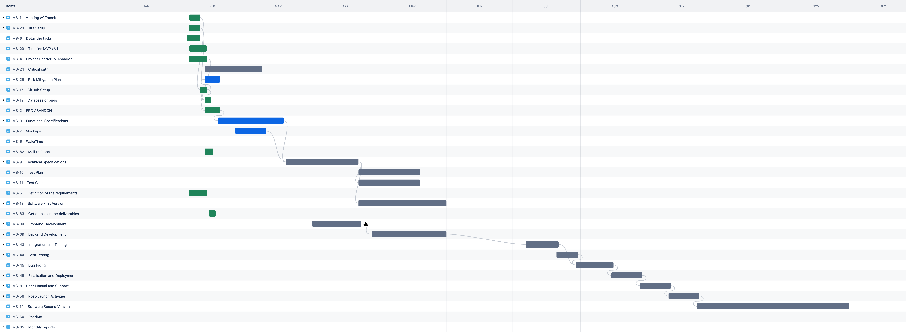

# Moonshot Report - Disposable Camera Application

## Report Introduction

The Disposable Camera Application represents a significant milestone in my professional journey in mobile application development. Designed to offer users a nostalgic yet modern way to capture and share moments at events, this project blends traditional disposable camera concepts with cutting-edge mobile technology to create a communal, event-based photo-sharing experience.

My professional journey has focused on mastering mobile and web technologies, particularly in creating user-friendly and accessible application designs. This project was developed as an MVP, challenging my skills in full-stack development, from front-end UI/UX design using React Native to back-end integration with Firebase for real-time data handling.

Through this MVP, I aimed to explore and refine various technologies, including iOS-specific features like App Clips and cloud services like Cloudflare for domain and content management. Initially targeted at iOS, the application is designed with future cross-platform expansion in mind.

During the development process, I encountered and overcame challenges such as compatibility issues between Firebase and iOS. These experiences provided valuable learning opportunities in troubleshooting and adapting to evolving technical environments. The Disposable Camera Application is not just a technical achievement but also a reflection of my commitment to creating meaningful, user-focused digital experiences.

Looking ahead, this MVP serves as the foundation for future enhancements and iterations planned for the next year, aiming to expand functionality, improve user experience, and reach a broader audience.

<details>
<summary>Table of content</summary>

- [Moonshot Report - Disposable Camera Application](#moonshot-report---disposable-camera-application)
  - [Report Introduction](#report-introduction)
- [Glossary](#glossary)
- [Functional Specification](#functional-specification)
  - [Project Overview](#project-overview)
  - [Project Definition](#project-definition)
    - [Vision](#vision)
    - [Objectives](#objectives)
    - [Scope](#scope)
      - [All Users (Both Organizer and Participant)](#all-users-both-organizer-and-participant)
      - [Admin Users (Organizer)](#admin-users-organizer)
      - [Participant Users (Full App)](#participant-users-full-app)
      - [Participant Users (App Clip)](#participant-users-app-clip)
    - [Out of Scope](#out-of-scope)
  - [Project Organisation](#project-organisation)
    - [Stakeholders](#stakeholders)
    - [Timeline](#timeline)
    - [Milestones](#milestones)
    - [Risks and Assumptions](#risks-and-assumptions)
      - [Risks](#risks)
      - [Assumptions](#assumptions)
    - [Constraints](#constraints)
  - [Functional Requirements](#functional-requirements)
    - [Features Overview](#features-overview)
    - [Features Breakdown](#features-breakdown)
      - [1. **Download the App**](#1-download-the-app)
      - [2. **Event Creation**](#2-event-creation)
      - [3. **Event Parameter Definition**](#3-event-parameter-definition)
      - [4. **QR Code Generation**](#4-qr-code-generation)
      - [5. **QR Code Sharing**](#5-qr-code-sharing)
      - [6. **General Gallery Access**](#6-general-gallery-access)
      - [7. **General Gallery Saving**](#7-general-gallery-saving)
      - [8. **Personal Gallery Access**](#8-personal-gallery-access)
      - [9. **Personal Gallery Deletion**](#9-personal-gallery-deletion)
      - [10. **Personal Gallery Saving**](#10-personal-gallery-saving)
      - [11. **Photo Capture**](#11-photo-capture)
      - [12. **Photo Sharing**](#12-photo-sharing)
      - [13. **Photo Downloading**](#13-photo-downloading)
      - [14. **App Access Without Download**](#14-app-access-without-download)
      - [15. **Internet Connectivity Requirement**](#15-internet-connectivity-requirement)
      - [16. **Real-Time Updates**](#16-real-time-updates)
      - [17. **Customer Support Access**](#17-customer-support-access)
      - [18. **Permission Prompting**](#18-permission-prompting)
      - [19. **User Data Management**](#19-user-data-management)
    - [User Roles and Permissions Matrix](#user-roles-and-permissions-matrix)
    - [User Interface and Design](#user-interface-and-design)
  - [Target Audience](#target-audience)
    - [Personas](#personas)
    - [Use Cases](#use-cases)
  - [Functional Analysis](#functional-analysis)
  - [Non-Functional Requirements](#non-functional-requirements)
    - [Reliability](#reliability)
    - [Performance](#performance)
    - [Scalability](#scalability)
    - [Security](#security)
    - [Usability](#usability)
    - [Operability](#operability)
    - [Recovery](#recovery)
    - [Delivery](#delivery)
    - [Maintainability](#maintainability)
  - [User Flows](#user-flows)
    - [Onboarding Flow](#onboarding-flow)
    - [App Clip Flow](#app-clip-flow)
  - [Legal and Compliance Requirements](#legal-and-compliance-requirements)
  - [Analytics and Reporting](#analytics-and-reporting)
  - [Localization and Internationalization](#localization-and-internationalization)
  - [Integration with Other Services](#integration-with-other-services)
  - [User Testing and Feedback](#user-testing-and-feedback)
  - [Future Enhancements and Roadmap](#future-enhancements-and-roadmap)
- [Technical Specification](#technical-specification)
  - [1. **Introduction**](#1-introduction)
  - [2. **Technologies Used**](#2-technologies-used)
    - [2.1 **Frontend**](#21-frontend)
    - [2.2 **Backend**](#22-backend)
    - [2.3 **iOS-Specific Technologies**](#23-ios-specific-technologies)
    - [2.4 **Database \& Storage Management**](#24-database--storage-management)
    - [2.5 **Web and Domain Management**](#25-web-and-domain-management)
    - [2.6 **Development Tools**](#26-development-tools)
    - [2.7 **Other Considerations**](#27-other-considerations)
  - [3. **Architecture Overview**](#3-architecture-overview)
    - [3.1 **System Architecture**](#31-system-architecture)
    - [3.2 **Component Diagram**](#32-component-diagram)
  - [4. **Data Flow**](#4-data-flow)
    - [4.1 **Event Creation**](#41-event-creation)
    - [4.2 **Image Handling**](#42-image-handling)
    - [4.3 **App Clip Interaction**](#43-app-clip-interaction)
  - [5. **Database Structure**](#5-database-structure)
    - [5.1 **Firestore Collections and Documents**](#51-firestore-collections-and-documents)
    - [5.2 **Firebase Storage Structure**](#52-firebase-storage-structure)
  - [6. **App Clips Setup**](#6-app-clips-setup)
    - [6.1 **Associated Domains**](#61-associated-domains)
    - [6.2 **AASA File Configuration**](#62-aasa-file-configuration)
  - [7. **Security Considerations**](#7-security-considerations)
  - [8. **Performance and Scalability**](#8-performance-and-scalability)
    - [8.1 **Performance**](#81-performance)
    - [8.2 **Scalability**](#82-scalability)
  - [9. **Deployment**](#9-deployment)
    - [9.1 **Deployment Process**](#91-deployment-process)
    - [9.2 **Continuous Integration/Continuous Deployment (CI/CD)**](#92-continuous-integrationcontinuous-deployment-cicd)
  - [10. **Testing and Quality Assurance**](#10-testing-and-quality-assurance)
    - [10.1 **Unit Testing**](#101-unit-testing)
    - [10.2 **Integration Testing**](#102-integration-testing)
    - [10.3 **User Acceptance Testing (UAT)**](#103-user-acceptance-testing-uat)
  - [11. **Documentation and Maintenance**](#11-documentation-and-maintenance)
    - [11.1 **Code Documentation**](#111-code-documentation)
    - [11.2 **User Documentation**](#112-user-documentation)
    - [11.3 **Maintenance**](#113-maintenance)
- [Analysis and Specifications of the Software Project](#analysis-and-specifications-of-the-software-project)
      - [Technology Choices](#technology-choices)
      - [Project Constraints](#project-constraints)
- [Software Architecture Choices](#software-architecture-choices)
- [Argumentation on the Choice of Algorithms and Their Relevance](#argumentation-on-the-choice-of-algorithms-and-their-relevance)
- [Presentation of the Tests and Deployment](#presentation-of-the-tests-and-deployment)
- [Evolutions Made or Planned for the Software Solution](#evolutions-made-or-planned-for-the-software-solution)
- [Analysis of Project Management and Leadership](#analysis-of-project-management-and-leadership)
- [Project Evolution and User Insights](#project-evolution-and-user-insights)
  - [Functional Specification Updates](#functional-specification-updates)
    - [Main App](#main-app)
    - [App Clip](#app-clip)
    - [Website](#website)
  - [Technical Specification Updates](#technical-specification-updates)
  - [User Testing and Feedback](#user-testing-and-feedback-1)
    - [Pain Points and Reasons for Change](#pain-points-and-reasons-for-change)
    - [Feature Requests](#feature-requests)
    - [Known Bugs](#known-bugs)
    - [Impressions \& Behavioral Insights](#impressions--behavioral-insights)
  - [Management Tools \& Process](#management-tools--process)

</details>

<br>

# Glossary

- **AASA (Apple App Site Association) File**: A JSON file hosted on a web server that iOS uses to associate domain names with apps, enabling features like Universal Links and App Clips.
- **App Clip**: A lightweight version of an iOS app that allows users to access key functionalities without downloading the full app, typically launched via URLs, NFC tags, or QR codes.
- **Associated Domains**: A feature in iOS that allows apps to associate with specific domain names, enabling functionalities such as Universal Links and App Clips.
- **Backend**: The server-side component of an application responsible for business logic, database management, and integration with other services.
- **CI/CD (Continuous Integration/Continuous Deployment)**: A set of practices that automate testing and deployment processes, ensuring that code changes are rapidly and reliably deployed to production environments.
- **Cloudflare**: A web infrastructure and security company providing services such as content delivery networks, DDoS mitigation, internet security, and domain name management.
- **Cloudflare Workers**: A serverless platform offered by Cloudflare that allows developers to run JavaScript applications at the network edge, used here to serve the AASA file.
- **Cross-Platform**: The ability for software to run on multiple platforms, such as iOS and Android.
- **Data Security**: The protection of data against unauthorized access, corruption, or theft, using encryption and other measures.
- **Disposable Camera**: A traditional single-use camera that inspired the app’s design and functionality.
- **Event**: A specific occasion where participants can join, take photos, and share them through the app.
- **Expo**: A framework and platform for developing React Native applications, providing tools and services for simplifying development, testing, and deployment processes.
- **Firebase**: A platform developed by Google that provides backend services like Firestore, a NoSQL database, and Firebase Storage for media storage, used in this project.
- **Firestore**: A NoSQL document database provided by Firebase, used to store and sync data in real-time for mobile and web applications.
- **Firestore Collections**: A method of organizing and storing groups of documents in Firestore, each collection containing multiple documents.
- **Firestore Documents**: Individual records within a Firestore collection, containing data as key-value pairs.
- **Firestore Sub-collections**: Collections within a document in Firestore, allowing for hierarchical organization of data.
- **GitHub**: A platform for version control and collaboration, enabling developers to manage and track changes in source code while supporting collaborative development.
- **GoDaddy**: A domain registrar and web hosting service used to manage the domain `disposableapp.xyz`.
- **GDPR (General Data Protection Regulation)**: A regulation in EU law on data protection and privacy.
- **Intellectual Property**: Legal rights concerning the ownership of creations of the mind, such as software and content.
- **Jest**: A JavaScript testing framework used for unit testing, primarily focused on testing React components and other JavaScript logic.
- **Milestones**: Key points in the project timeline marking significant progress.
- **Non-Functional Requirements**: Criteria used to judge the operation of a system, such as performance and reliability.
- **Personal Data**: Information relating to an identifiable person, such as photos and event participation data.
- **Project Management**: The process of planning and overseeing the development of the app.
- **QR Code**: A machine-readable code used for storing URLs or other information, scannable by smartphone cameras.
- **React Native**: A framework for building mobile applications that render natively on iOS and Android, using JavaScript and React.
- **Regulatory Compliance**: Adherence to laws and regulations relevant to the app’s development and use.
- **Reviewers**: Individuals or groups responsible for evaluating the project’s compliance with required standards.
- **Risks and Assumptions**: Considerations regarding potential issues (risks) and conditions assumed to be true (assumptions) during project planning.
- **Scope**: The boundaries of the project, including what will be developed and what will be excluded.
- **Stakeholders**: Individuals or organizations with an interest in the project’s outcome.
- **Swift**: A programming language developed by Apple for building software across Apple’s ecosystem, including iOS, macOS, watchOS, and tvOS.
- **SwiftUI**: A framework by Apple for building user interfaces across Apple platforms using Swift, focusing on declarative syntax.
- **TLS/SSL (Transport Layer Security/Secure Sockets Layer)**: Protocols for encrypting data sent over the internet, ensuring secure communication between clients and servers.
- **Timeline**: The schedule for the project, including key dates and milestones.
- **UAT (User Acceptance Testing)**: The process where end-users test the application to ensure it meets business requirements and is ready for production.
- **URL (Uniform Resource Locator)**: The address used to access resources on the internet, such as web pages or App Clips.
- **User Interface (UI)**: The part of the app that users interact with, including design and navigation elements.
- **Visual Studio Code**: A code editor optimized for building and debugging modern web and cloud applications, widely used for developing React Native apps.
- **Xcode**: Apple’s integrated development environment (IDE) for developing software for macOS, iOS, watchOS, and tvOS, including tools for testing and deployment.


# Functional Specification

## Project Overview

The Disposable Camera application aims to provide users with a nostalgic and communal experience of capturing and sharing moments at events. Inspired by traditional disposable cameras, the app offers a user-friendly interface that allows participants to take photos, share them with others, and create lasting memories.

Participants can access the app through an App Clip, which allows them to join events and participate without downloading the full app. Each event has its own gallery where photos are automatically shared with all attendees, fostering a communal experience. Initially designed for iOS, the app is intended to be cross-platform compatible in future iterations.

## Project Definition

### Vision

The vision for the Disposable Camera application is to create a user-friendly mobile app that facilitates the capturing and sharing of memorable moments during events. By leveraging the nostalgic appeal of disposable cameras and combining it with modern technology, the app enhances event experiences, fostering greater interaction among attendees.

The app is designed to be intuitive and accessible, catering to users of all ages, with a particular focus on simplifying the user experience for older individuals. By enabling access through an App Clip and limiting the number of photos each participant can take, the app encourages users to be more present and engaged during events.

### Objectives

1. **Enhance Accessibility**: Ensure the app is intuitive and user-friendly, making it accessible to users of all ages.
2. **Seamless Access**: Utilize App Clips to allow participants to join events and share photos without needing to download the full app.
3. **Foster Engagement**: Limit photo-taking to encourage mindfulness and selective capturing of moments.
4. **Facilitate Instant Sharing**: Automatically share photos in a communal event gallery.
5. **Cross-Platform Compatibility**: Start with iOS and expand to other platforms in future iterations.
6. **Promote Inclusivity**: Create an inclusive app that fosters meaningful connections among attendees.
7. **Enhance Event Experience**: Combine modern technology with nostalgic elements to enrich event experiences.

### Scope

#### All Users (Both Organizer and Participant)

Taking photos:
-   Capture photos using the app's camera interface during the event (Full App only).
-   Change camera side.
-   Use the flash.

Access to the general gallery:
-   Share photos taken during the event with other participants and admin users.
-   View and browse photos shared by all participants in the event's general gallery.
-   Download event photos shared by other participants or admin users for personal use.

Connected to the internet:
-   Require an active internet connection for users to access the app's features and functionalities, such as event participation and photo sharing.

Constant refresh:
-   Implement real-time updates and automatic refresh functionalities to ensure that users have access to the latest event information and shared photos.

Customer support:
-   Provide access to customer support resources within the app, such as FAQs, help guides, and contact information, to assist users with any issues or inquiries.

Asking for permission from users:
-   Prompt users for permission before accessing sensitive device features or personal data, such as camera access, location information, and contact details.

Giving users access to their data:
-   Enable users to access and manage their data stored within the app, such as profile information, event history, and shared photos.

#### Admin Users (Organizer)

Creation of an event:
-   Ability to create new events within the app.
-   Define event parameters and settings, including maximum photo limits and event duration.

Sharing a QR code:
-   Generate a unique QR code linked to each event for participant access.
-   Allow admin users to share the QR code via various channels (e.g., email, messaging) to invite participants.

Access to the general and personal galleries:
-   Going through all photos shared within the app's general gallery.

#### Participant Users (Full App)

Joining an event:
-   Participants can join an event by clicking the "Join Event" button and entering the event ID.
-   Participants must refer their name when joining an event.

Event participation:
-   Participants can take photos during the event, download photos, or leave the event.
-   Participants have access to both their personal gallery and the general gallery of the event.

Leaving an event:
-   Participants can choose to leave the event at any time.

#### Participant Users (App Clip)

Joining an event:
-   Participants can join an event by scanning a QR code using their device’s camera, which will open the App Clip.
-   Participants must refer their name when accessing the event through the App Clip.

Event participation:
-   Participants can only download and upload photos within the event.
-   The App Clip does not require the participant to download the full app, and it provides access to the general event gallery only.


### Out of Scope

The following features are not included in the current version of the Disposable Camera app but may be considered for future releases:

-   **Editable Event Duration**: The duration of events cannot be modified once created.
-   **Customizable Number of Photos per User**: The number of photos each user can take is fixed.
-   **Adjustable Photo Release Timing**: The timing for releasing photos cannot be altered after the event is created.
-   **Video Capture**: The app does not support video recording.
-   **Photo Filters**: Users cannot apply filters to photos.
-   **Location Tracking**: The app does not collect or display location information.
-   **Instagram Integration**: Users cannot share photos directly to Instagram from the app.
-   **Event Templates**: There are no predefined templates for creating events.
-   **Multiple Admin Roles**: Each event is managed by a single admin.
-   **Pre-scheduled Events**: Events cannot be scheduled in advance.
-   **Live Streaming**: The app does not support live streaming of events.
-   **Virtual Reality Integration**: VR features are not included.
-   **Reward System**: The app does not offer rewards or badges for users.

## Project Organisation

### Stakeholders

| Stakeholder       | Role                                  |
|-------------------|---------------------------------------|
| Clémentine CUREL  | Lead and manage the project           |
| ALGOSUP           | Provides academic guidance            |
| Reviewers         | Evaluate the project for grading      |

### Timeline

Project management, task allocation, and progress tracking were initially coordinated using [JIRA](https://virtual-processor.atlassian.net/jira/core/projects/MS/timeline). However, JIRA was quickly abandoned due to its lack of suitability for my working style, particularly as a solo developer. Instead, I transitioned to using a more flexible and immediate approach, relying on GitHub commit messages and a physical whiteboard for task management.

The project timeline is represented in the Gantt chart below:



### Milestones

| Milestone        | Description                                       |
|------------------|---------------------------------------------------|
| Functional       | Completion of functional requirements and features|
| Technical        | Implementation of technical architecture          |
| Roadmap          | Development plan for future iterations            |
| V1               | Release of the first version of the application   |
| Jury 1           | Presentation and evaluation by the first jury     |
| User Testing     | Conducting user testing and gathering feedback    |
| V2               | Release of the second version of the application  |
| Jury 2           | Presentation and evaluation by the final jury     |

### Risks and Assumptions

#### Risks

- **Technical Issues**: Potential bugs may delay progress or affect functionality.
- **Scope Creep**: Expanding scope may increase workload and delay completion.
- **Resource Constraints**: Limited budget and expertise could impact deadlines.
- **Compatibility Issues**: Cross-platform compatibility might present challenges.
- **User Adoption**: Low engagement could impact the app’s success.
- **Data Security Breaches**: Security vulnerabilities could compromise user data.
- **Regulatory Compliance**: Failure to comply with laws could result in legal issues.
- **External Dependencies**: Reliance on third-party services may introduce risks.

#### Assumptions

- Users have access to smartphones with compatible operating systems.
- Users have a stable internet connection.
- Users are familiar with mobile applications.
- Event participants actively engage with the app.
- Users consent to sharing their photos within the app.

### Constraints

**Resource Constraints**: Limited budget for software licenses.

**Time Constraints**: Strict deadlines imposed by academic institutions.

**Legal and Regulatory Constraints**: Compliance with GDPR and other regulations.

## Functional Requirements

### Features Overview

1. **Download the App**: Available initially on iOS, downloadable from the App Store.
2. **Event Creation**: Create events and define the parameters; event is created immediately upon validation.
3. **Event Parameter Definition**: Define event parameters such as duration, maximum photo limits, and other settings.
4. **QR Code Generation**: Generate a unique QR code linking to the event’s App Clip.
5. **QR Code Sharing**: Admin users can share the QR code via various channels (e.g., email, messaging) to invite participants.
6. **General Gallery Access**: Users can access the general gallery to view shared photos.
7. **General Gallery Saving**: Users can save photos from the general gallery to their devices.
8. **Personal Gallery Access**: Users can access their gallery to view their own shared photos.
9. **Personal Gallery Deletion**: Users can delete photos from their gallery.
10. **Personal Gallery Saving**: Users can save photos from their gallery to their devices.
11. **Photo Capture**: Users can capture photos using the app's camera interface.
12. **Photo Sharing**: Participants and organizer users can share event photos within the app.
13. **Photo Downloading**: Users can download event photos shared by others.
14. **App Access Without Download**: Participants can access event features without downloading the app.
15. **Internet Connectivity Requirement**: Require an active internet connection for users to access app features.
16. **Real-Time Updates**: Provide real-time updates and automatic refreshes for the latest event information.
17. **Customer Support Access**: Offer access to customer support resources within the app.
18. **Permission Prompting**: Prompt users for permission before accessing sensitive device features or personal data.
19. **User Data Management**: Enable users to access and manage their personal data.


### Features Breakdown

#### 1. **Download the App**

-   **Description**: Users can download the app from the App Store. Initially, the app is available only on iOS.
-   **Requirements**:
    -   App Store listing must be created with accurate descriptions, screenshots, and metadata.
    -   Ensure the app meets all App Store guidelines.

#### 2. **Event Creation**

-   **Description**: Admin users can create new events within the app. Events are created immediately upon clicking the validation button.
-   **Requirements**:
    -   Event creation interface must allow users to define parameters like duration, maximum photo limits, etc.
    -   Once created, events should generate a unique identifier (Event ID).

#### 3. **Event Parameter Definition**

-   **Description**: Admin users can define specific parameters for each event, such as duration, maximum number of photos per participant, and other customizable settings.
-   **Requirements**:
    -   Interface should allow for easy input of event parameters.
    -   Parameters should be editable until the event is finalized.

#### 4. **QR Code Generation**

-   **Description**: The app generates a unique QR code for each event, linking directly to the event’s App Clip.
-   **Requirements**:
    -   QR codes must be dynamically generated and linked to specific event IDs.
    -   QR codes should be compatible with standard QR code readers.

#### 5. **QR Code Sharing**

-   **Description**: Admin users can share the event QR code through various communication channels, such as email or messaging apps.
-   **Requirements**:
    -   Integration with device sharing features (e.g., iOS Share Sheet).
    -   Ensure QR codes are accessible and can be scanned by participants.

#### 6. **General Gallery Access**

-   **Description**: Participants can view all photos shared in the event's general gallery.
-   **Requirements**:
    -   Gallery interface should display photos in a grid format.
    -   Implement scrollable or paginated views for easy navigation.

#### 7. **General Gallery Saving**

-   **Description**: Users can save photos from the general gallery directly to their devices.
-   **Requirements**:
    -   Implement photo-saving functionality with appropriate permissions.
    -   Ensure photos are saved in a standard format (e.g., JPEG).

#### 8. **Personal Gallery Access**

-   **Description**: Users can access their personal gallery to view photos they have uploaded or taken during the event.
-   **Requirements**:
    -   Personal gallery should be accessible from the user’s profile or a dedicated section within the app.
    -   Photos should be organized by event.

#### 9. **Personal Gallery Deletion**

-   **Description**: Users can delete photos from their personal gallery.
-   **Requirements**:
    -   Implement a confirmation prompt before deletion.
    -   Ensure that deleted photos are removed from the app’s storage and not recoverable.

#### 10. **Personal Gallery Saving**

-   **Description**: Users can save photos from their personal gallery to their devices.
-   **Requirements**:
    -   Provide a straightforward option to download and save images.
    -   Ensure images retain their original quality during the saving process.

#### 11. **Photo Capture**

-   **Description**: Users can take photos using the app’s built-in camera interface during an event.
-   **Requirements**:
    -   The camera interface must include essential features such as shutter control, switching between front and rear cameras, and enabling/disabling the flash.
    -   Ensure the captured photos are automatically saved to the event’s gallery.

#### 12. **Photo Sharing**

-   **Description**: Both participants and organizers can share photos within the event, making them accessible in the general gallery.
-   **Requirements**:
    -   Implement an easy-to-use photo sharing feature.
    -   Photos should be instantly available to other participants in the general gallery.

#### 13. **Photo Downloading**

-   **Description**: Users can download photos shared by others within the event.
-   **Requirements**:
    -   Allow users to select and download multiple photos at once.
    -   Ensure that downloading photos respects the event’s privacy settings.

#### 14. **App Access Without Download**

-   **Description**: Participants can join events and access basic features without downloading the full app, using the App Clip.
-   **Requirements**:
    -   App Clip should offer essential features such as viewing the general gallery, uploading, and downloading photos.
    -   Ensure the App Clip is lightweight and complies with size limitations.

#### 15. **Internet Connectivity Requirement**

-   **Description**: An active internet connection is required to access most features of the app, including event participation, photo sharing, and gallery access.
-   **Requirements**:
    -   Implement checks for active internet connectivity.
    -   Provide user-friendly error messages or offline prompts when the internet is unavailable.

#### 16. **Real-Time Updates**

-   **Description**: The app provides real-time updates for the latest event information, such as newly shared photos.
-   **Requirements**:
    -   Ensure the app’s UI automatically refreshes to display new content.

#### 17. **Customer Support Access**

-   **Description**: Users can access customer support resources directly within the app.
-   **Requirements**:
    -   Include a dedicated support section with FAQs, a help guide, and contact options.
    -   Consider integrating live chat or a ticketing system for direct user support.

#### 18. **Permission Prompting**

-   **Description**: The app prompts users for permission before accessing sensitive device features or personal data, such as the camera or photo gallery.
-   **Requirements**:
    -   Permissions must be requested at appropriate times (e.g., when first using the camera).
    -   Provide clear explanations for why permissions are needed and how they will be used.

#### 19. **User Data Management**

-   **Description**: Users can access and manage their personal data within the app, including photos and event participation history.
-   **Requirements**:
    -   Provide a user-friendly interface for managing personal data.
    -   Include options for users to delete their data, including account deactivation or deletion.

### User Roles and Permissions Matrix

This matrix outlines what each user role can do within the Disposable Camera application, both in the full app and the App Clip version.

| **Feature/Functionality**            | **Organizer (Full App)** | **Participant (Full App)** | **App Clip User**     |
|--------------------------------------|--------------------------|----------------------------|-----------------------|
| **Event Creation**                   | Yes                      | No                         | No                    |
| **QR Code Generation**               | Yes                      | No                         | No                    |
| **Photo Capture (Camera Access)**    | Yes                      | Yes                        | No                    |
| **Photo Upload (Gallery Access)**    | Yes                      | Yes                        | Yes                   |
| **Photo Download**                   | Yes                      | Yes                        | Yes                   |
| **View Personal Gallery**            | Yes                      | Yes                        | No                    |
| **View General Event Gallery**       | Yes                      | Yes                        | Yes                   |
| **Manage Photos (Delete/Edit)**      | Yes (Own Photos)         | Yes (Own Photos)           | No                    |                |
| **Settings Access**                  | Yes                      | Yes                        | No                    |
| **Name/Pseudo Prompt**               | No                       | Yes                        | Yes                   |
| **Post-Event Access (30 Days)**      | Yes                      | Yes                        | Yes                   |

### User Interface and Design

To explore the mock-up of the Disposable Camera App, you can click on this [Figma link](https://www.figma.com/design/Y0JWQtRMokJs5hnwLF1sDu/DISPOSABLE-MOCK-UP?node-id=0-1&t=uNiJCGJkkmKKLWKL-1).

Graphic charter:


## Target Audience

### Personas

1. **Margaret**: An elderly woman who wants to collect photos from her grandson’s baptism.


2. **Sarah**: A young mother capturing candid moments during Christmas.


3. **James**: A groom wanting to enhance guest engagement at his wedding.


4. **Emily**: A social media-savvy individual capturing her anniversary party.


5. **Alex**: A meticulous planner organizing a successful party.


### Use Cases

1. **Margaret's Baptism Photos**
   - **Actor**: Margaret
   - **Description**: Margaret desires to receive photos of all participants at her grandson's baptism, as she lacks photography skills and financial resources to hire a professional. She aims to ensure comprehensive coverage of the event by obtaining photos taken by others.
   - **Preconditions**: Margaret has access to the app through the App Clip or full app.
   - **Postconditions**: Margaret successfully collects photos from other participants, enhancing the coverage of her grandson's baptism.
   - **Flow**: 
     - Margaret attends her grandson's baptism, equipped with the Disposable Camera app.
     - Aware of her limitations in capturing photos, Margaret interacts with other attendees and encourages them to take photos with the app during the event.
     - Throughout the ceremony, Margaret communicates her desire to receive copies of photos taken by other participants.
     - As a result, Margaret receives a variety of photos taken by different individuals, enriching the coverage of her grandson's baptism and ensuring she has memories captured from various perspectives.

2. **Sarah's Christmas Celebration**
   - **Actor**: Sarah
   - **Description**: Sarah aims to capture candid moments during her family's Christmas celebration using the Disposable Camera app.
   - **Preconditions**: Sarah has shared the QR code of the Disposable Camera app with family members.
   - **Postconditions**: Sarah collects digital photos

 taken during the celebration via the Disposable Camera app and compiles them for a family album.
   - **Flow**:
     1. Before the Christmas celebration, Sarah shares the QR code of the Disposable Camera app with family members, warning them that they don't have to download the app.
     2. Throughout the event, family members use the Disposable Camera app to capture candid moments, such as opening presents, sharing meals, and playing games.
     3. After the celebration, Sarah collects the digital photos taken by family members using the Disposable Camera app.
     4. Sarah compiles the digital photos into a digital or printed family album, preserving the memories of the Christmas celebration captured through the app.

3. **James's Wedding Engagement**
   - **Actor**: James
   - **Description**: James aims to enhance guest engagement at his wedding by providing a virtual disposable camera experience through the Disposable Camera app.
   - **Preconditions**: James has created an event on the Disposable Camera app and shared the event QR code with wedding guests.
   - **Postconditions**: James collects digital photos taken during the wedding celebration via the Disposable Camera app and compiles them for a keepsake album.
   - **Flow**:
     1. Before the wedding ceremony, James creates an event on the Disposable Camera app and shares the event QR code with wedding guests via email, text message, or printed cards.
     2. Guests attend the wedding reception and use their smartphones to scan the event QR code and access the Disposable Camera app without downloading it.
     3. Throughout the wedding festivities, guests use the Disposable Camera app to capture candid photos of themselves, the bride and groom, and other guests.
     4. After the wedding, James collects the digital photos taken by guests using the Disposable Camera app.
     5. James compiles the digital photos into a keepsake album, preserving the memories of his special day captured through the app.

4. **Emily's Anniversary Party**
   - **Actor**: Emily
   - **Description**: Emily wants to capture fun moments during her anniversary party using the Disposable Camera app and share them on Instagram.
   - **Preconditions**: Emily has created an event on the Disposable Camera app and shared the event QR code with party attendees. Emily has an Instagram account.
   - **Postconditions**: Emily posts digital photos taken during the anniversary party via the Disposable Camera app on her Instagram profile.
   - **Flow**:
     1. Before the anniversary party, Emily creates an event on the Disposable Camera app and shares the event QR code with party attendees.
     2. Guests attend the anniversary party and use their smartphones to scan the event QR code and access the Disposable Camera app without downloading it.
     3. Throughout the party, Emily and her friends use the Disposable Camera app to capture photos of themselves, their activities, and the decorations.
     4. After the party, Emily collects the digital photos taken by guests using the Disposable Camera app.
     5. Emily selects the best photos from the event and edits them if necessary (on another app).
     6. Emily posts the edited photos on her Instagram profile, adding captions and hashtags to share the memories of her anniversary celebration with her followers.

5. **Alex's Party Planning**
   - **Actor**: Alex
   - **Description**: Alex wants to ensure a successful party by coordinating various aspects of planning and execution using the Disposable Camera app.
   - **Preconditions**: Alex has access to resources for party planning and coordination.
   - **Postconditions**: The party is executed smoothly, and attendees have an enjoyable experience.
   - **Flow**:
     1. Alex begins by setting a date and theme for the party and creates an event on the Disposable Camera app.
     2. Alex shares the event QR code with invited guests, allowing them to access the Disposable Camera app without downloading it.
     3. Alex organizes logistics such as decorations, food and drinks, and entertainment, updating the event details on the Disposable Camera app.
     4. On the day of the party, Alex uses the Disposable Camera app to capture photos of the setup, guests, and activities, contributing to the event's digital album.
     5. Throughout the party, Alex encourages guests to use the Disposable Camera app to capture their own photos and share them within the event album.
     6. After the party, Alex reviews the photos collected through the Disposable Camera app, sharing highlights with attendees and preserving memories of the event digitally.

## Functional Analysis

**Legend:** 


<br>

**Authentication:**


<br>

**Home screen:**


<br>

**Camera:**


<br>

**Personal gallery:**


<br>

**Personal settings:**


<br>

**General gallery:**


<br>

**Create event:**


<br>

**Event Settings:**


<br>


## Non-Functional Requirements

### Reliability
- **Uptime**: The app should have an uptime of 99.9%, ensuring minimal downtime.
- **Error Handling**: Gracefully handle errors, providing user-friendly messages and avoiding crashes.
- **Data Consistency**: Ensure consistency in photo uploads and downloads, even under network interruptions.

### Performance
- **Loading Times**: The app must load quickly, with initial launch times under 3 seconds.
- **Real-Time Updates**: Ensure real-time updates for new photos and event information.

### Scalability
- **User Capacity**: Support a large number of simultaneous users, especially during large events.
- **Event Data Handling**: Efficiently manage a large volume of photos without performance degradation.

### Security
- **Data Encryption**: Use industry-standard encryption for data at rest and in transit.
- **GDPR Compliance**: Ensure compliance with GDPR for user data privacy.
- **Access Control**: Restrict access to photos and data based on user roles.

### Usability
- **User Interface**: Design an intuitive UI that is easy to navigate.
- **Accessibility**: Include basic accessibility features for users with disabilities.

### Operability
- **Cross-Platform Consistency**: Ensure the design is adaptable for future cross-platform support.
- **Ease of Maintenance**: Maintain a well-documented codebase for easy updates.

### Recovery
- **Data Integrity**: Ensure no data is lost in case of crashes; use automatic backups.
- **Crash Recovery**: The app should restart and recover to a stable state after a crash.

### Delivery
- **App Store Compliance**: Ensure the app complies with Apple App Store guidelines.
- **Update Process**: Support over-the-air updates with minimal user disruption.

### Maintainability
- **Code Documentation**: Ensure all code is well-documented.
- **Version Control**: Use GitHub for version control to track and manage changes.

## User Flows

### Onboarding Flow

1. **Download the App**:
   - User downloads the app from the App Store.
   - On first launch, the user is greeted with a brief introduction to the app’s features.
   - The user is asked to allow access to the camera and photo library.
   - For organizers, a quick tutorial on how to create an event is provided.

2. **Event Creation (Organizer)**:
   - Organizer selects "Create Event" from the home screen.
   - Fills out event details (name, photo limit, duration).
   - The app generates a unique QR code for the event.
   - The QR code is displayed and can be shared with participants.

3. **Event Participation (Participant)**:
   - Participant scans the event QR code using their phone’s camera.
   - If using the full app, they are directed to the event gallery.
   - If using the App Clip, they are prompted to enter their name/pseudo before accessing the gallery.

### App Clip Flow

1. **Scanning the QR Code**:
   - User scans the event QR code using their phone’s native camera.
   - The App Clip is launched immediately without the need for a full download.

2. **Entering Name/Pseudo**:
   - Upon first use, the App Clip prompts the user to enter their name or pseudo.
   - This information is used to personalize their experience during the event.

3. **Accessing the Event Gallery**:
   - The user is presented with a unified gallery view showing all event photos.
   - The user can browse existing photos and choose to download them.

4. **Uploading Photos**:
   - The user can upload photos directly from their device’s gallery.
   - The App Clip will request access to the user’s photo library for this purpose.

5. **Exiting the App Clip**:
   - The user can exit the App Clip at any time by closing it.
   - Data (such as name/pseudo) is retained only for the session unless saved by the full app.

## Legal and Compliance Requirements

- **GDPR Compliance**: Ensure the app adheres to GDPR regulations, including user consent for data collection and the right to access, rectify, and delete personal data.
- **Terms of Service and Privacy Policy**: Users must agree to the app’s terms of service and privacy policy upon first use. The policies should be accessible at any time within the app.
- **Data Retention Policy**: Specify that event data will be retained for 30 days post-event, after which it will be permanently deleted.

## Analytics and Reporting

- **User Engagement**: Track how users interact with the app, including time spent on different screens, the number of photos uploaded/downloaded, and participation rates.
- **Event Metrics**: Provide organizers with basic analytics, such as the number of photos uploaded and the number of active participants.
- **Crash Reports**: Collect and analyze crash reports to identify and address stability issues.

## Localization and Internationalization

- **Language Support**: Initially, the app will support English,

 with plans to add additional languages based on user demand.
- **Date/Time Formats**: Ensure that date and time formats are localized based on the user’s region.
- **Cultural Sensitivity**: Ensure that the app’s content, including icons and color schemes, is culturally appropriate for different regions.

## Integration with Other Services

- **Cloud Storage**: Use cloud storage for storing event photos, ensuring scalability and reliability.
- **Social Media Sharing**: In future iterations, consider integrating social media sharing directly from the app.
- **Analytics Platforms**: Integrate with analytics platforms to track user behavior and app performance.

## User Testing and Feedback

- **User Testing Plan**: Conduct user testing with a diverse group of participants, including those with different levels of tech-savviness.
- **Feedback Collection**: Provide in-app mechanisms for users to submit feedback and report issues.
- **Iteration and Improvement**: Use the collected feedback to prioritize improvements in future updates.

## Future Enhancements and Roadmap

- **Cross-Platform Expansion**: Expand the app to Android and potentially other platforms based on demand.
- **Video Capture**: Consider adding video capture functionality in a future version.
- **Event Templates**: Introduce pre-defined event templates to simplify event creation.
- **Multiple Admin Roles**: Allow for multiple organizers to manage a single event.
- **Rewards/Badge System**: Introduce a reward system for users who participate in multiple events.


# Technical Specification

## 1. **Introduction**

The Disposable Camera application is a mobile app designed to provide users with a nostalgic and communal experience of capturing and sharing moments at events. This technical specification document outlines the architecture, technologies, and processes used to develop and maintain the application. The app is initially targeted for iOS, with plans for cross-platform support in the future.

## 2. **Technologies Used**

### 2.1 **Frontend**

- **React Native (Expo)**
  - **Purpose**: To build the mobile application for both iOS and, in the future, Android platforms.
  - **Details**: 
    - **Expo**: A framework and platform for universal React applications that run on all devices. It simplifies development and deployment by providing tools and services tailored for React Native.
  - **Benefits**:
    - Streamlined development with rapid prototyping and easy testing on different platforms.
    - Access to native APIs (e.g., Camera, Location) through managed packages.

### 2.2 **Backend**

- **Firebase**
  - **Purpose**: Serves as the backend for the application, handling data storage, and media storage.
  - **Components**:
    - **Firestore**: A NoSQL document database used to store event data, including metadata about events, photos, and participants.
      - **Collections**: `events` (containing documents for each event).
      - **Sub-collections**: `images` and `participants` under each event.
    - **Firebase Storage**: Used for storing event-related media (e.g., photos).
      - **File Naming**: Photos are stored with a naming convention that includes the user’s name and a sequence number.
      - **Integration**: URLs for accessing stored images are saved in Firestore.

### 2.3 **iOS-Specific Technologies**

- **App Clips**
  - **Purpose**: Provides a lightweight version of the app that allows iOS users to interact with specific event-related features without downloading the full app.
  - **Technologies**:
    - **Swift & SwiftUI**: Used to develop the App Clip, offering a native iOS experience.
    - **Associated Domains & AASA File**: Required for enabling App Clips, ensuring the correct routing and access through QR codes.
    - **Hosting**: Managed by Cloudflare, with AASA file management to define the associated domains and capabilities.

- **Cloudflare**
  - **Purpose**: Manages DNS settings, SSL certificates, and serves the AASA file required for App Clips.
  - **Details**:
    - Provides infrastructure for secure and scalable access to the AASA file.
    - Supports routing and domain management for `disposableapp.xyz`.

### 2.4 **Database & Storage Management**

- **Firestore**
  - **Purpose**: Serves as the primary database for the application.
  - **Details**:
    - Handles real-time updates, ensuring that all participants in an event see the latest photos and information.
    - Provides scalability and security for managing multiple events and users.

- **Firebase Storage**
  - **Purpose**: Manages storage for all event-related media.
  - **Details**:
    - Stores images securely and provides URLs that can be embedded in the app for displaying photos.
    - Integrates seamlessly with Firestore to link media with corresponding metadata.

### 2.5 **Web and Domain Management**

- **GoDaddy**
  - **Purpose**: The domain registrar for `disposableapp.xyz`.
  - **Details**:
    - Manages domain settings, which are critical for ensuring that the app and its features (like App Clips) are accessible.

- **Cloudflare Workers**
  - **Purpose**: A serverless computing platform used to serve the AASA file and manage requests related to domain-specific operations.
  - **Details**:
    - Provides the correct content type and security headers required by iOS for App Clips.

### 2.6 **Development Tools**

- **GitHub**
  - **Purpose**: Version control and source code management.
  - **Details**:
    - Hosts the project repository, including all code, documentation, and issue tracking.
    - Provides CI/CD potential for automated testing and deployment in the future.

- **Xcode**
  - **Purpose**: IDE for developing and testing iOS-specific features, including the App Clip.
  - **Details**:
    - Used for building and deploying the App Clip, managing certificates, and configuring associated domains.

- **Visual Studio Code**
  - **Purpose**: Primary code editor for writing React Native code.
  - **Details**:
    - Supports a wide range of plugins for linting, debugging, and enhancing the development workflow.

### 2.7 **Other Considerations**

- **No Authentication**
  - **Purpose**: Simplifies the user experience by storing data locally and in Firebase without user accounts.
  - **Details**:
    - Currently, the app does not use Firebase Authentication or any other authentication method. All data interactions are managed directly on the device or within Firebase.

- **No Notifications**
  - **Purpose**: Notifications are not implemented, focusing the app’s scope on core functionality.
  - **Details**:
    - Consider integrating Firebase Cloud Messaging (FCM) in future updates if notifications become a required feature.

## 3. **Architecture Overview**

### 3.1 **System Architecture**

The system architecture is designed to support a scalable and reliable event-based photo-sharing platform. The architecture comprises the following components:

- **Frontend**: Built with React Native using Expo, targeting iOS devices initially. The frontend interacts with Firebase to fetch and store data.
- **Backend**: Firebase serves as the backend, handling data storage with Firestore and media storage with Firebase Storage.
- **App Clip**: A lightweight version of the app, developed using Swift and SwiftUI, which allows users to participate in events without downloading the full app.
- **Database**: Firestore is used for structured data storage, and Firebase Storage handles media files.
- **Domain and Routing**: Managed by Cloudflare, with Cloudflare Workers serving the AASA file for App Clips.

### 3.2 **Component Diagram**

The following diagram outlines the major components of the Disposable Camera application:

```
[Frontend (React Native - Expo)]
       |
       |---> [Firebase (Firestore, Storage)]
       |
[Backend]
       |
       |---> [iOS App Clip (Swift, SwiftUI)]
       |
[Cloudflare (AASA, Routing)]
       |
       |---> [GoDaddy (Domain Management)]
```

## 4. **Data Flow**

### 4.1 **Event Creation**

1. **Admin (Organizer) Action**:
   - The organizer creates an event in the app by providing details such as event name, duration, and maximum photo limit.
   - A unique event ID is generated and stored in Firestore.
   - A QR code linking to the App Clip is generated for participants.

2. **Data Storage**:
   - Event metadata (e.g., event name, duration, number of photos) is stored in Firestore under the `events` collection.
   - Each event’s photos are stored in Firebase Storage in a folder named after the event ID.

3. **User Interaction**:
   - Participants can join the event by scanning the QR code, which opens the App Clip.
   - Participants take photos, which are uploaded and stored under the corresponding event’s folder in Firebase Storage.

### 4.2 **Image Handling**

1. **Photo Capture**:
   - Participants capture photos using the app’s built-in camera interface.
   - The photo is stored locally on the device until it is uploaded to Firebase Storage.

2. **Photo Upload**:
   - Photos are uploaded to Firebase Storage with a naming convention that includes the participant’s name and a sequence number.
   - The URL of the uploaded photo is saved in Firestore under the event’s `images` sub-collection.

3. **Photo Access**:
   - Photos are accessible to all participants in the event through the general gallery.
   - Participants can download photos directly from the app.

### 4.3 **App Clip Interaction**

1. **Accessing the App Clip**:
   - Participants scan a QR code associated with an event.
   - The App Clip opens, prompting the participant to enter their name.

2. **App Clip Features**:
   - Participants can view the general gallery, upload photos, and download photos.
   - The App Clip does not provide access to personal settings or the full app’s functionality.

3. **Data Sync**:
   - All interactions within the App Clip are synced with Firebase, ensuring that the full app and the App Clip share the same data.

## 5. **Database Structure**

### 5.1 **Firestore Collections and Documents**

- **Collection: `events`**
  - **Document ID**: `eventId` (e.g., `Also_1725111327712`)
  - **Fields**:
    - `appClipURL`: (string) URL to the App Clip for this event.
    - `duration`: (number) Duration of the event in hours.
    - `eventId`: (string) Unique identifier for the event.
    - `eventName`: (string) Name of the event.
    - `numberOfPhotos`: (number) Maximum number of photos each participant can take.
    - `reveal`: (string) Determines when photos are revealed (e.g., `revealNow`).
    - `revealTime`: (string) Timestamp for when photos should be revealed.
    - `start`: (string) Determines when the event starts (e.g., `startNow`).
    - `userName`: (string) Name of the organizer.

  - **Sub-collections**:
    -

 **Collection: `images`**
      - **Document Fields**:
        - `owner`: (string) Name of the participant who took the photo.
        - `timestamp`: (number) Unix timestamp of when the photo was taken.
        - `url`: (string) URL of the photo stored in Firebase Storage.
    - **Collection: `participants`**
      - **Document Fields**:
        - `name`: (string) Name of the participant.
        - `role`: (string) Role in the event (e.g., `organizer`).
        - `userId`: (string) Unique identifier for the participant.

### 5.2 **Firebase Storage Structure**

- **Folder: `eventId` (e.g., `Also_1725111327712`)**
  - **Files**: 
    - Photos are stored as `userNameX.jpg` where `X` is the sequence number (e.g., `Frfe1.jpg`).
    - Each file is stored with metadata linking it to the participant who took the photo.


## 6. **App Clips Setup**

### 6.1 **Associated Domains**

- **Purpose**: Ensure that the App Clip can be accessed via the generated QR codes and associated domains.
- **Setup**:
  - **Domain**: `disposableapp.xyz`
  - **Associated Domains**: Defined in the Apple Developer account and linked to the app through the AASA file.

### 6.2 **AASA File Configuration**

- **Purpose**: The Apple App Site Association (AASA) file is necessary for configuring the associated domains for the App Clip.
- **Hosted By**: Cloudflare.
- **AASA File Example**:
  ```javascript
  export default {
    async fetch(request, env, ctx) {
      const aasaContent = {
        "applinks": {
          "apps": [],
          "details": [
            {
              "appIDs": ["<APP_ID>.com.moonshot.disposable.Clip"],
              "paths": ["/clip/*"]
            }
          ]
        },
        "webcredentials": {
          "apps": ["<APP_ID>.com.moonshot.disposable.Clip"]
        },
        "appclips": {
          "apps": ["<APP_ID>.com.moonshot.disposable.Clip"]
        }
      };

      const jsonBody = JSON.stringify(aasaContent);

      return new Response(jsonBody, {
        headers: {
          'Content-Type': 'application/json',
          'Cache-Control': 'no-cache',
          'Access-Control-Allow-Origin': '*',
        },
      });
    },
  };
  ```

## 7. **Security Considerations**

- **Data Encryption**:
  - All data at rest (in Firebase Storage and Firestore) and in transit is encrypted using industry-standard protocols (e.g., TLS/SSL).
- **Access Control**:
  - No authentication is implemented for user access, simplifying the user experience but relying on local device security.
- **Data Privacy**:
  - Compliant with GDPR, ensuring that users’ data can be accessed, rectified, and deleted upon request.
- **Domain Security**:
  - SSL certificates are managed by Cloudflare to secure communication between the app, the backend, and associated domains.

## 8. **Performance and Scalability**

### 8.1 **Performance**
- **App Performance**:
  - The app is optimized to load quickly, with an initial launch time target of under 3 seconds.
- **Real-Time Updates**:
  - Firestore’s real-time capabilities are leveraged to ensure that all participants see updates (e.g., new photos) as soon as they occur.

### 8.2 **Scalability**
- **User Capacity**:
  - The system is currently designed for limited traffic but can be scaled by leveraging Firebase’s infrastructure to handle more users.
- **Event Data Handling**:
  - Efficient data handling strategies, including the use of Firestore’s real-time listeners, ensure that even large volumes of photos can be managed without performance degradation.

## 9. **Deployment**

### 9.1 **Deployment Process**
- **Expo CLI**:
  - Used to build and deploy the React Native app. The command `npx expo prebuild --platform ios` prepares the app for deployment.
- **Xcode**:
  - Required for building and deploying the App Clip. The app and the App Clip are both submitted to the App Store via Xcode.
- **Cloudflare Workers**:
  - Deployed using the command `npm run deploy` to ensure the AASA file and other configurations are served correctly.

### 9.2 **Continuous Integration/Continuous Deployment (CI/CD)**
- **GitHub Actions**:
  - Potential for future integration with GitHub Actions to automate testing, building, and deployment processes.

## 10. **Testing and Quality Assurance**

### 10.1 **Unit Testing**
- **Tools**:
  - Jest is used for unit testing of React components and other JavaScript logic.
  - XCTest is used for testing the Swift code in the App Clip.

### 10.2 **Integration Testing**
- **Tools**:
  - Detox or Cypress can be used for end-to-end testing of the app’s flows, ensuring that the interaction between the frontend and backend works as expected.

### 10.3 **User Acceptance Testing (UAT)**
- **Process**:
  - Conducted by real users to ensure the app meets the business requirements and provides a seamless user experience.
  - Feedback from UAT will be incorporated into the development cycle for further improvements.

## 11. **Documentation and Maintenance**

### 11.1 **Code Documentation**
- **Location**: All code is documented inline, with further documentation stored in the GitHub repository’s Wiki.
- **Details**: Includes explanations of key functions, architecture decisions, and deployment instructions.

### 11.2 **User Documentation**
- **Purpose**: Guides for end-users and administrators on how to use the app’s features, available on the app’s website.
- **Feedback Mechanism**:
  - Users can provide feedback directly through the app or via the website, enabling continuous improvement.

### 11.3 **Maintenance**
- **Process**: 
  - Regular updates will be released to fix bugs, improve performance, and introduce new features based on user feedback.
  - Maintenance cycles will be managed via GitHub and communicated to users through release notes.


# Analysis and Specifications of the Software Project

The Disposable Camera Application was conceived to blend the nostalgia of traditional disposable cameras with the convenience and connectivity of modern mobile technology. The core idea is to provide users with a simple and communal way to capture and share moments at events.

#### Technology Choices
- **Development Framework**: After evaluating React Native, React Expo, and Flutter, I chose React Native with Expo. Expo simplifies development by providing a set of tools that streamline the process of building, testing, and deploying mobile apps. I opted for Expo because of its strong community support, extensive documentation, and ease of use.
  
- **Platform Focus**: Although Android is often considered easier for initial development due to fewer restrictions, I prioritized iOS. This decision was influenced by my desire to gain experience with iOS development and my interest in leveraging the iOS-exclusive App Clip feature, which offers a seamless user experience for event-based interactions. My previous experience with the Google Play Store during a project at ALGOSUP made iOS a new and exciting challenge.

- **Database Selection**: Firebase was chosen for its comprehensive documentation, real-time database capabilities, and free tier for initial development. However, I later encountered compatibility issues with Swift and iOS, particularly when integrating Firebase with the App Clip. These issues highlighted the potential drawbacks of using Firebase in an iOS-centric project, especially as upgrading to Firebase's Blaze plan was necessary for full functionality.

#### Project Constraints
- **Use of Xcode and Swift**: Developing the App Clip necessitated the use of Xcode and Swift, which introduced a learning curve. Additionally, the $100 annual fee for an Apple Developer account was a budgetary constraint. I initially attempted to find workarounds to avoid this cost, which ultimately delayed the project.

- **Event Availability Duration**: Initially, I planned to keep events accessible for only one hour after they ended. However, after considering user convenience, I extended this period to one month, allowing users more time to access and download their event photos.

- **App Clip Image Upload**: Due to the App Clip's size limitations (ranging from 10MB to 50MB), I decided against allowing users to take photos directly within the App Clip. Instead, users can upload images, a more lightweight operation that aligns with the App Clip's constraints.

# Software Architecture Choices

The Disposable Camera Application was designed with a client-server architecture, where the front-end interacts with the Firebase backend to manage event data and photos.

- **Architecture Design**: The architecture is intentionally simple and not highly scalable because the project was not intended to compete with established solutions. Instead, it serves as a proof of concept and a learning tool. The decision to use Firebase as the backend, despite its limitations with iOS, was driven by the need for rapid development and ease of use.

- **Scalability Considerations**: While scalability was not a primary focus, the application was built with the understanding that it could be scaled in the future if necessary. Existing solutions offer robust scalability options, but they come with higher costs, which was a consideration in my decision-making process.

# Argumentation on the Choice of Algorithms and Their Relevance

The project did not involve complex algorithms or data structures, as the focus was on creating a user-friendly interface and seamless interaction with Firebase. 

- **Algorithm Choice**: The application uses standard data handling and CRUD (Create, Read, Update, Delete) operations to manage events and photos within Firebase. The simplicity of the application's functionality did not require advanced algorithms.

- **Relevance**: The algorithms and data structures chosen are effective for the scope of this project, providing the necessary functionality without overcomplicating the development process. As the project evolves, more sophisticated algorithms could be introduced if needed.

# Presentation of the Tests and Deployment

Due to the project's current state, extensive testing has not yet been implemented. However, the plan for the future includes a comprehensive testing strategy.

- **Testing**: No formal testing framework was implemented during development. Future plans include unit tests using Jest for React components and XCTest for Swift code in the App Clip. Integration testing will be conducted to ensure seamless interaction between the front-end and Firebase.

- **Deployment**: The project is currently not ready for deployment to the App Store due to unresolved issues with Firebase integration in Xcode. The app will be deployed via the App Store once these issues are resolved, with the deployment process managed through Xcode for the iOS app and App Clip, and GitHub for version control.

# Evolutions Made or Planned for the Software Solution

Several significant changes were made during the development process:

- **Organizational Changes**: Initially, project management was handled through Jira. However, as I was the sole developer, I transitioned to managing tasks through GitHub commit messages and a physical whiteboard in my workspace. This approach allowed for more flexible and immediate task management.

- **Design Evolution**: The app's design underwent significant simplification. The original design was complex, but after creating a first draft, I realized that a more minimalist approach would be more effective and user-friendly.

- **Library Use**: I initially planned to use the `react-native-app-clip` library but found that it did not function as expected. This discovery led to the development of the App Clip using native Swift, which better suited the project’s needs.

- **Database Selection**: Although I considered using MongoDB, Firebase was chosen for its superior documentation and ease of integration with the other tools in the project. However, the challenges with Firebase and iOS compatibility may prompt a reconsideration of the database choice in future iterations.

- **Future Plans**: Planned improvements include deploying the application on the App Store, conducting performance tests, and making the application scalable. Future updates and changes will be documented on the project website, and user feedback will be collected through the app and the website (disposableapp.xyz).

# Analysis of Project Management and Leadership

Managing this project presented several challenges, particularly in maintaining a timeline and overcoming technical obstacles.

- **Timeline Management**: At the project's start, I created a detailed timeline. However, working solo allowed for flexible working hours, which led to deviations from the original schedule. While the overall project goals remained the same, the timeline shifted to accommodate varying workloads and problem-solving efforts.

- **Project Management Tools**: I initially used Jira for task management, but as the project progressed, I found that using GitHub commit messages and a whiteboard for task tracking was more efficient given my working style.

- **Challenges and Solutions**: Throughout development, I encountered several significant issues, many stemming from misunderstandings of documentation or the technical limitations of the chosen tools. The most critical challenge occurred three days before the deadline when the project ceased to run. This issue, primarily related to Firebase integration with Xcode, led to extensive troubleshooting, including repeatedly clearing Xcode’s derived data, resetting build caches, and restarting the project from scratch multiple times.

- **Key Obstacles**: The major obstacle was a persistent error related to Firebase integration: `No such module 'FirebaseFirestore'`. Despite following standard troubleshooting steps, including resetting package caches, I encountered another error: `gRPC-Core.modulemap not found`. This issue has been reported by others but remains unresolved, preventing the main app from being built in Xcode and thus blocking the app’s submission to the App Store and TestFlight.

- **Leadership and Resilience**: Despite these challenges, I remained focused on ensuring the core functionalities worked together, with the events and database interactions functioning as intended. While the app cannot currently be deployed to the App Store, the primary objectives were met, and the app is operational in a development environment.

Excellent idea. Explaining **why** changes were made gives depth to your iteration process and shows thoughtful decision-making. Here's the updated section, now with clear rationales for each major change:


# Project Evolution and User Insights

## Functional Specification Updates

### Main App

- **Upload photos**: Added based on repeated user requests to upload images. This improves flexibility and accommodates users who don’t take photos from the application, but use their phone camera settings instead.
- **“Reveal later” option**: Enables surprise photo sharing at the end of the event—great for weddings and parties. This feature increase the excitement of the participants. 
- **Countdown removed**: I found the countdown unnecessary and sometimes confusing. It is now only shown when the “reveal later” setting is active.
- **Event deletion after 8 days**: Keeps Firebase usage lean and reflects user behavior—most people download their photos within a week. The extra day is a buffer to ensure availability.

### App Clip

- **Added camera functionality**: Initially excluded due to App Clip size limitations and technical constraints. But many users wanted to take photos directly from the App Clip, so I optimized the codebase in Swift to make room for this feature.

### Website

- **Photo gallery website**: Created to give users an easy way to browse and download event photos—especially useful for those who prefer using a browser or haven't installed the app. This feature also serves as a workaround for App Clip users, who face significant limitations in terms of security, capabilities, and size. For instance, App Clips cannot download images directly due to iOS sandboxing and permission restrictions. The website provides a more complete and flexible experience for users who want to save memories from their events.

## Technical Specification Updates

- **Switch from React Native Expo to Swift**: Expo proved limiting for integrating native iOS features like App Clips. Managing multiple environments (main app, App Clip, Firebase, camera, REST APIs) was complex and brittle in Expo. Migrating to Swift unified the codebase, simplified the App Clip build, and improved performance and compatibility.
- **Still using Firebase**: Firestore and Firebase Storage continue to offer robust, scalable solutions for real-time photo sharing. The structure was solid—no need to change.
- **App Clip backend via REST**: The App Clip couldn’t use Firestore SDK due to size and performance constraints. REST APIs were more lightweight and reliable.
- **Firebase Hosting for AASA**: Hosting the AASA file on Firebase Hosting made setup faster, more stable, and easier to debug compared to Cloudflare Workers.
- **Cloudflare DNS-only**: Now only used for domain pointing and SSL management—no longer needed for dynamic content or backend logic.

## User Testing and Feedback

### Pain Points and Reasons for Change

- **Missing navigation in the camera**: When the camera is opened, the navigation icons become hidden behind and is still clickable. For the users this is confusing. Letting the navigation visible at all times was a simple fix that improved usability significantly. 
- **QR code sharing is unintuitive**: When a qrcode is shared, the messaged send is not "pretty" enough. This pain point hasn't being addressed yet. I am still exploring solutions to generate more user-friendly messages that include the QR code and a link to the event.
- **Blurry QR codes**: In the application, the QR codes were blurry and hard to scan. I fixed this by changing the library that generates the QR codes, ensuring they are clear and easily scannable. This change was crucial for user experience, especially at events where quick access is needed.

### Feature Requests

- **Upload photos from the main app**: Users wanted to use their device's native camera or editing tools before uploading. This feature improves flexibility and meets the needs of users who prefer taking photos outside the app.
- **Camera in App Clip**: Highly requested by users who scan a QR code at an event and expect to take photos immediately. This improves spontaneous engagement and makes the App Clip more functional.
- **QR code opens the main app**: If already have the main app installed, users expect the QR code to launch it instead of the App Clip. This is a common user expectation and improves the transition between the App Clip and the full app.
- **French version**: Requested by non-English speakers during testing. Offering localization improves accessibility and inclusivity.
- **Longer events**: Some events, like vacations or festivals, span multiple days. The previous 24-hour limit was too short. With the new default duration set to 8 days, the app now better suits longer experiences.
- **Android version**: A major priority for parity, especially in mixed-device groups. Developing an Android version requires rewriting the entire app in Kotlin. Since Android doesn’t support App Clips, **Google Play Instant** would be used instead. This is a **long-term goal** due to significant development effort, platform differences, and Google Play’s new requirement of a **15-day test with at least 12 users** before public release.
- **Time to print QR codes**: Originally, QR code generation triggered the event countdown immediately, making it difficult to prepare and distribute printed materials. Now, the event lasts 8 days by default, and the countdown appears only if the "reveal later" option is selected—giving organizers more control over timing and design prep.

### Known Bugs

- **Front flash not working**: Due to hardware/software limitations, this feature is still under investigation.
- **No “reveal later” on App Clip**: App Clips are stateless and time-limited, making this technically complex. Considering alternatives.
- **QR code behavior inconsistent**: Improvements have been made to force QR codes to launch the full app instead of the App Clip when appropriate.

### Impressions & Behavioral Insights

- People don’t always understand the purpose of Disposable when handed a phone—onboarding needs simplification.
- Users take many photos quickly—they’re used to unlimited photo apps. The limit creates confusion but also fun.
- Power users prefer keeping multiple events active—event switching or archiving is a potential enhancement.
- In tightly knit groups, once users have the main app, they stop using the App Clip—expected behavior that supports the transition model.

## Management Tools & Process

My management approach remained consistent throughout the project, emphasizing flexibility and adaptability. I used GitHub for both version control and task tracking, relying heavily on commit messages to document progress and outline next steps.

The App Store Connect system is now integrated with GitHub for both the main app and the App Clip. This setup enables automated tests and version control on every commit. Similarly, Firebase Hosting for the website is also connected to GitHub—every push updates the live website automatically.

However, updating the app on the App Store still requires manual action in Xcode. While CI/CD helps with testing and pre-validation, App Store submissions still need to be handled manually, due to Apple’s deployment requirements.
