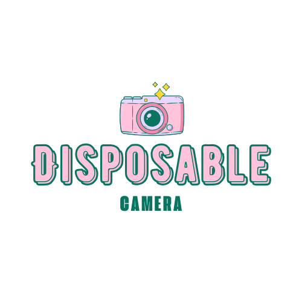

<p align="center"><em>What if you could have the nostalgia of a disposable camera... but in your pocket?</em></p>
<p align="center">
  
</p>
<p align="center">
  <a href="#features">Features</a> • 
  <a href="#installation">Installation</a> • 
  <a href="#app-clip-instructions">App Clip</a> • 
  <a href="#version-history">Version History</a> • 
  <a href="#roadmap">Roadmap</a> • 
  <a href="#documentation">Documentation</a> • 
  <a href="#known-issues">Known Issues</a> • 
  <a href="#contact">Contact</a>
</p>

<br>

Welcome to the **Disposable App** – a nostalgic, minimalist photo-sharing experience built for real-world events like **weddings**, **festivals**, **parties**, and **bar nights**. One event, one shared camera, one unforgettable album.

> 🚧 **No longer available on the [App Store](https://apps.apple.com/fr/app/disposable-app/id6670355967?l=en-GBhttps://apps.apple.com/fr/app/disposable-app/id6670355967?l=en-GB)**  
> 🌐 Explore more: [www.disposableapp.xyz](https://www.disposableapp.xyz)  
> 📔 Read my Thesis: [Thesis.pdf](./Documents/Thesis/ThesisCompressed.pdf)


## Features

### Main App (iOS)
- 📅 Create or join events with custom durations and names
- 📸 Take photos with limited shots per participant
- 🖼️ View and download shared event photos
- 🔒 Option to reveal photos only at the end of the event
- 🎯 QR code to easily invite participants
- 🔧 Organizer-only settings and event control

### App Clip
- 🔗 Join instantly from a QR code or universal link
- 🧑‍🤝‍🧑 Enter your name and start participating
- 🖼️ View event gallery and upload your own photos
- 📸 *(Coming soon)* Take photos directly via App Clip’s native camera

## Installation

### Prerequisites
- Xcode 15+
- CocoaPods
- Real iOS device (camera required)

⚠️ Firebase access is currently **restricted to the developer only**.

### Setup Steps
```bash
git clone https://github.com/Clementine951/MOONSHOT-DISPOSABLE.git
cd MOONSHOT-DISPOSABLE/src
open Disposable.xcworkspace
```

## App Clip Instructions

1. Open Xcode and choose the `DisposableClip` target  
2. Add environment variable in the scheme:  
   `_XCAppClipURL=https://appclip.disposableapp.xyz/clip?eventId=YOUR_EVENT_ID`  
3. Run and test via simulator or QR code

## Version History

| Version | Highlights |
|--------|------------|
| 1.0 | Initial SwiftUI-based release – main app only |
| 1.1 | App Clip integrated and connected via REST API |
| 1.2 | Bug Fixing |
| ⏩ Next | Open event from QR code in main app, improved UI, App Clip native camera, photo uploading from main app, editable event settings |


## Roadmap

- 🎨 UI/UX improvements across both experiences
- 📸 Add camera functionality directly in the App Clip
- 🔗 Allow main app to open/join via QR code
- 🔧 Enable modifying event settings during an event
- 🤖 Android version (will come later)


## Documentation

- [📓 Functional Specification](./Documents/Old%20Specifications/FunctionalSpecification.md)
- [🧠 Technical Specification](./Documents/Old%20Specifications/TechnicalSpecification.md)
- [🎓 Moonshot Report](./Documents/Presentation%202024/Report.pdf)
- [📊 Gantt Chart Timeline (deprecated)](./Documents/Images/timeline.png)
- [📄 Presentation Slides ](./Documents/Presentation%202024/Presentation.pdf)
- [💼 Business Plan](./Documents/Version2/BusinessPlan.md)
- [🗣️ User Feedback Summary](./Documents/Version2/UserFeedback.md)
- [📚 Thesis](./Documents/Thesis/Thesis.pdf)

## Known Issues

- 🧭 Navigation bar disappears when switching to the camera
- 📸 Photos in “reveal later” mode are still accessible from App Clip before the event ends
- 📥 Joining via QR code in the **main app** isn't available yet

### ✅ Resolved
- ❌ App Clip couldn’t connect to Firestore → ✅ Fixed using the REST API
- ❌ Main app couldn’t be submitted due to Firebase issues → ✅ Fixed by rewriting in **Swift**
- ❌ Firestore dependency issues in Xcode → ✅ Fixed by rewriting in **Swift**
- ❌ Camera permissions mishandled → ✅ Now properly requested

## Contact

- 👩‍💻 Created by **Clémentine Curel**
- 🌐 Website: [www.disposableapp.xyz](https://www.disposableapp.xyz)
- 📧 Email: [clementine.curel@algosup.com](mailto:clementine.curel@algosup.com)
