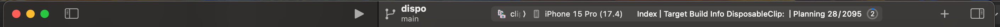
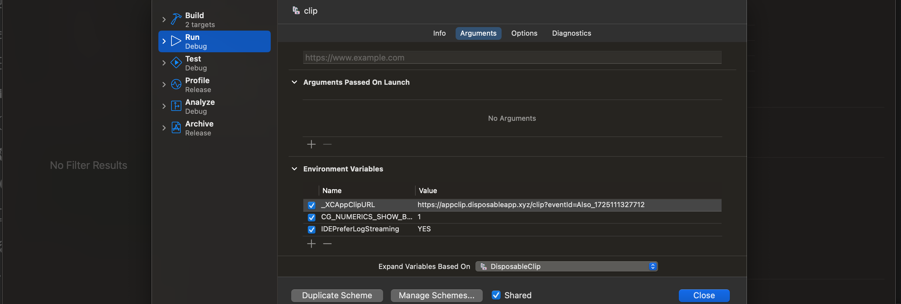
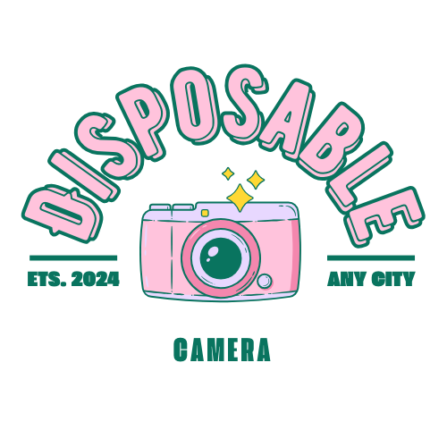

# Disposable Camera Application

Welcome to the Disposable Camera Application project! This project is inspired by the nostalgia of traditional disposable cameras and aims to recreate that experience in a modern, digital format. The app allows users to capture and share moments at events in a communal way, making memories more interactive and accessible.

The project includes a full iOS app and an App Clip for seamless event participation. While the main app offers comprehensive features for organizing and participating in events, the App Clip allows users to quickly join and contribute without needing to install the full app. The project is currently in the development stage, with some known issues related to Firebase integration that are being resolved.

## Project Documentation

For detailed documentation on the project, including functional specifications, technical architecture, and development processes, please refer to the following links:

- [Moonshot Report - Disposable Camera Application](./Documents/Report.md)
- [Report in PDF](./Documents/Report.pdf)
- [Gantt Chart Timeline](./Documents/Images/timeline.png)
- [Functional Specification](./Documents/FunctionalSpecification.md)
- [Technical Specification](./Documents/TechnicalSpecification.md)
- [Presentation PDF](./Documents/Presentation.pdf)

## Prerequisites

Before launching the project, ensure you have the following tools and dependencies installed:

- **Node.js**: [Install Node.js](https://nodejs.org/)
- **npm**: Included with Node.js, required for managing dependencies.
- **Xcode**: [Install Xcode](https://developer.apple.com/xcode/) (for building and running iOS applications).
- **IDE**: Any preferred IDE like Visual Studio Code (VSCode) for editing and running the project.

## Setup Instructions

Follow these steps to set up the project locally:

1. **Clone the Repository:**
   ```bash
   git clone https://github.com/Clementine951/MOONSHOT-DISPOSABLE.git
   ```
   Or download the project as zip.
2. **Navigate to the Project Directory:**
   ```bash
   cd Disposable
   ```
3. **Install Dependencies:**
   ```bash
   npm install
   ```
4. **Set Up iOS Dependencies:**
   ```bash
   cd ios
   pod install
   ```

## Launching the Main Application

**Open Your IDE:**
   - Use VSCode or any other preferred IDE.
   ```bash
   npm install
   npm start -c
   ```

## Launching the App Clip

1. **Open Xcode:**
   - Open Xcode and select "Open an existing project."
   - Navigate to the `ios` directory and open the `.xcworkspace` file. (white logo)
  
   Or
   - Open Xcode with the terminal.
   
   ```bash
   open *.xcodeproj
   ```
   
3. **Set the Target to Clip:**
   - In Xcode, set the target to `DisposableClip`.


4. **Run the App Clip:**
   - Click on the `Run` button in Xcode to start the App Clip.

## Testing the App Clip

**Verify the Scheme:**
   - Ensure that the `Clip` scheme is selected and has the correct environment variables, such as the `_XCAppClipURL`.
   - To test the app clip with an event that you have created with the main application, change the value of `_XCAppClipURL` with `https://appclip.disposableapp.xyz/clip?eventId=` and the `eventId`
   - example: https://appclip.disposableapp.xyz/clip?eventId=Event_19873757282



## Known Issues

### Main App Launch Issue in Xcode

Currently, the main app cannot be launched via Xcode due to the following error:

```bash
No such module 'FirebaseFirestore'
```

### Attempted Resolution Error

When attempting to resolve this issue by resetting package caches, the following error occurs:

```bash
/path/Disposable/ios/Pods/Target Support Files/gRPC-C++/gRPC-C++-dummy.m module map file '/path/Disposable/ios/Pods/Headers/Private/grpc/gRPC-Core.modulemap' not found
```

### Current Workaround

Despite these issues, the main app can be launched via an IDE like VSCode, but due to these unresolved issues, the application cannot be submitted to the App Store or TestFlight at this time.


